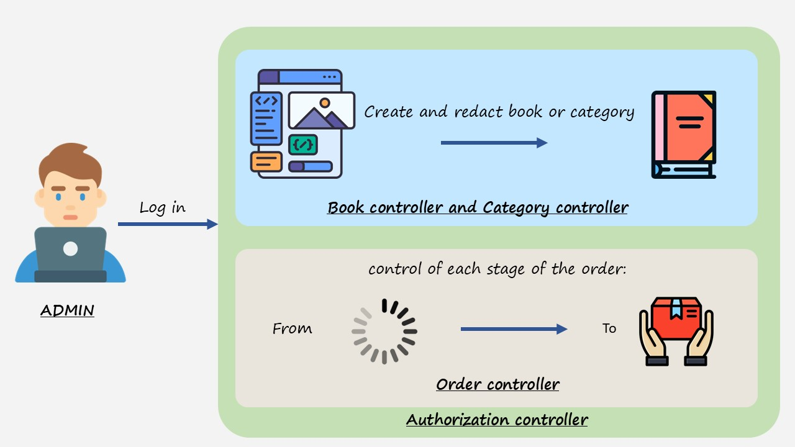

**Introduction**

This project was created to test my skills in developing the backend for a bookstore. I’ve always wanted to build something from scratch, and this project became a great opportunity to apply my knowledge and skills in practice, as well as improve the quality of my code. In the application, users are divided into two roles: Admin and User.

The Admin has the ability to create, delete, and update books and categories, as well as manage order statuses.

The User, on the other hand, can add books to the cart, change their quantity or remove them, and place orders after selecting products.

---

**Technologies and Tools**  
In this project, I used the following technologies and tools:

- **Spring Boot** — for rapid development and creation of the backend application.
- **Spring Security** — for ensuring security and implementing authentication.
- **JWT (JSON Web Token)** — for token-based authentication and authorization.
- **Spring Data JPA** — for convenient database interaction and object-relational mapping.
- **MySQL** — as the database to ensure high performance and ease of management.
- **Liquibase** — for database migration management and schema version control.
- **Docker** — for containerizing the application, simplifying deployment and scaling.
- **Testcontainers** — for integration testing using real containerized dependencies, such as databases.
- **Swagger** — for automatic API documentation and convenient testing.
- **Postman** — for manual API testing and verifying its functionality.
- **Maven** — for dependency management and project building.

---

**Functionality**  
The project includes the following main features:

- **UserController**: User management (registration, authorization).
- **BookController**: Book management (adding, editing, deleting, and searching for books, retrieving book information).
- **CategoryController**: Book category management (creating, editing, deleting categories, retrieving a list of categories).
- **OrderController**: Order management (creating orders and viewing order history).
- **CartController**: Cart management (adding, removing, and updating the quantity of books, viewing cart contents).

---

**Installation and Setup**  
To run this project locally, follow these steps:

1. **Clone the repository**:
   ```bash
   git clone https://github.com/retkinf/book-shop
   ```

2. **Navigate to the project folder**:
   ```bash
   cd book-shop
   ```

3. **Install dependencies using Maven**:
   ```bash
   mvn clean install
   ```

4. **Configure the database**:
    - Open the `application.properties` file.
    - Specify the database connection parameters (e.g., URL, username, and password).

5. **Start Docker**:
    - Ensure Docker is installed and running on your machine.

6. **Run the application**:
    - Use the `Shift + F10` shortcut (or run it through your IDE).
    - Alternatively, execute the command:
      ```bash
      mvn spring-boot:run
      ```

---

**Usage**

After launching the application, you can access the API via Swagger UI at the following address:  
[http://localhost:8080/api/swagger-ui/index.html](http://localhost:8080/api/swagger-ui/index.html)

For convenient testing, I have created a Postman collection that you can import and use to test the API. The collection includes example requests for all available endpoints. Here is the link to the collection:  
[https://www.postman.com/orbital-module-candidate-80082765/workspace/book-shop/request/34994240-60781fb3-2da4-463e-94b4-5e3daa9fbfd2?action=share&creator=34994240&ctx=documentation](https://www.postman.com/orbital-module-candidate-80082765/workspace/book-shop/request/34994240-60781fb3-2da4-463e-94b4-5e3daa9fbfd2?action=share&creator=34994240&ctx=documentation)

Short demo:   
[https://www.loom.com/share/32e83677dfca4b89be23ba6f0b1136e7?sid=f91830a1-0fca-42b6-92dd-c00876d0e80c](https://www.loom.com/share/32e83677dfca4b89be23ba6f0b1136e7?sid=f91830a1-0fca-42b6-92dd-c00876d0e80c)